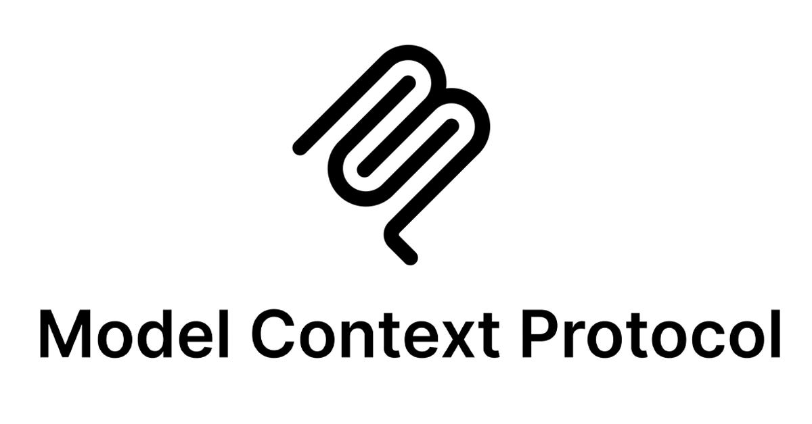
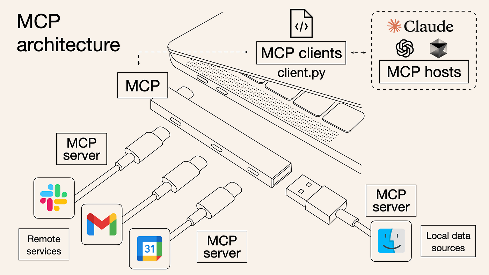
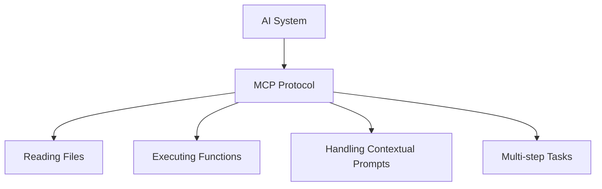
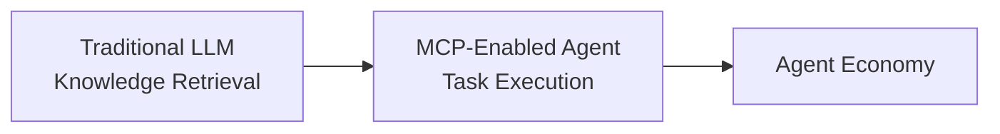
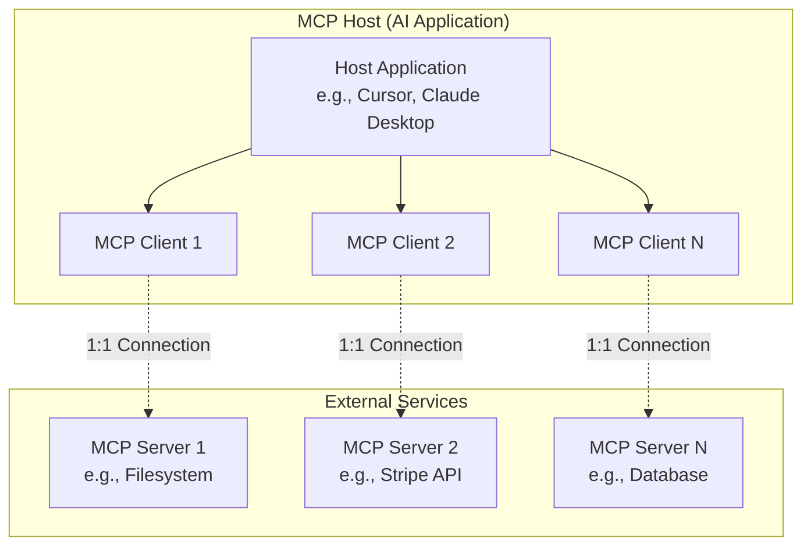
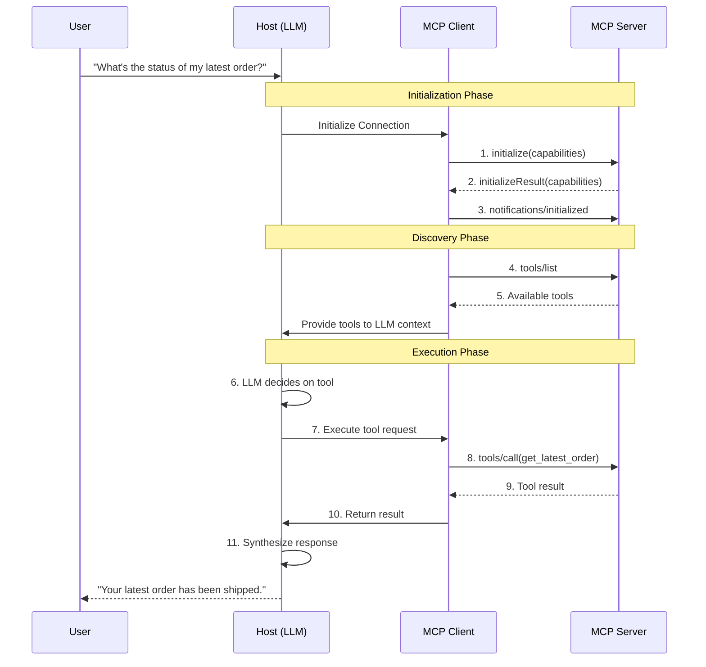
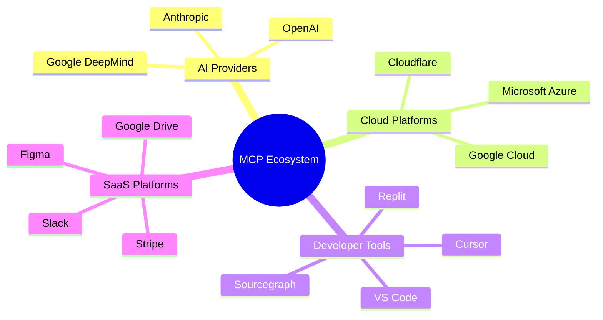
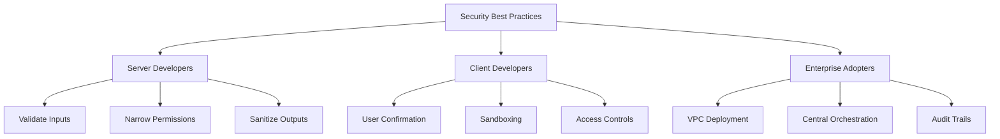
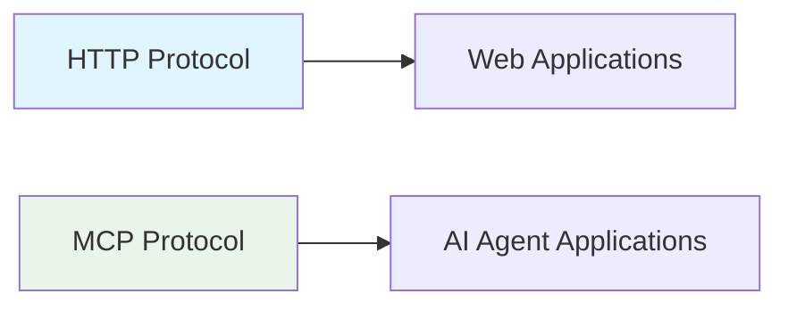

# The Definitive Guide to the Model Context Protocol (MCP)



## Table of Contents
- [Introduction](#introduction)
- [What is MCP?](#what-is-mcp)
- [Core Purpose](#core-purpose)
- [Why MCP Matters](#why-mcp-matters)
- [Technical Architecture](#technical-architecture)
- [Getting Started](#getting-started)
- [MCP Ecosystem](#mcp-ecosystem)
- [Security Considerations](#security-considerations)
- [Comparison with Alternatives](#comparison-with-alternatives)
- [Resources and Community](#resources-and-community)

## Introduction

The Model Context Protocol (MCP) is an **open-source, open standard framework** introduced by Anthropic on November 25, 2024. It fundamentally standardizes how artificial intelligence (AI) systems, particularly Large Language Models (LLMs), integrate and communicate with external tools, data sources, and services.

> 🚀 **Rapid Adoption**: Following its introduction, MCP saw immediate adoption by major industry players including OpenAI and Google DeepMind, signaling broad consensus on its utility and importance.

## What is MCP?

### The "USB-C for AI" Analogy



MCP is frequently described as the **"USB-C port for AI"** - providing a universal, standardized digital communication protocol that enables:

- ✅ Any MCP-compliant AI application (host) to connect with any MCP-compliant tool or data source (server)
- ✅ Elimination of custom, one-off integration code for each pairing
- ✅ Creation of an open, interoperable ecosystem
- ✅ Prevention of proprietary, walled-garden solutions

## Core Purpose

### Solving the "Integration Bottleneck"

MCP addresses the critical challenge where AI projects fail due to the complexity of connecting LLMs to:
- 🗄️ Siloed databases
- 🔧 Legacy systems  
- 🏢 Proprietary enterprise platforms
- 📁 Local file systems

### Universal Interface Capabilities



## Why MCP Matters

### Solving Key LLM Limitations

| Limitation | Traditional Problem | MCP Solution |
|------------|-------------------|--------------|
| **Hallucinations** | LLMs generate plausible but incorrect information | Direct access to authoritative data sources |
| **Knowledge Cutoffs** | Information frozen at training data collection | Real-time access to live systems and current data |

### Unlocking Agentic AI


MCP enables the transition from **passive responders** to **active "doers"**:



### Real-World Applications

| Industry | Use Case | Example |
|----------|----------|---------|
| **Software Development** | AI-assisted coding | Cursor, Sourcegraph, Zed, Replit |
| **Enterprise Automation** | Data analysis & workflows | Query databases, check payments, draft messages |
| **Personal Assistance** | Schedule & task management | Calendar integration, note organization |
| **Creative Workflows** | Design to code | Figma to front-end code generation |

## Technical Architecture

### Core Components




#### Component Roles

| Component | Role | Description |
|-----------|------|-------------|
| **MCP Host** | AI Application | User-facing AI environment (IDE, chatbot, etc.) |
| **MCP Client** | Connector | Maintains 1:1 connection with each server |
| **MCP Server** | Tool/Data Provider | Exposes functionality through standardized primitives |

### Two-Layer Protocol Stack

#### Data Layer (Inner Layer)
- **Protocol**: JSON-RPC 2.0
- **Message Types**: Requests, Responses, Notifications
- **Core Primitives**:

| Primitive | Purpose | Example |
|-----------|---------|---------|
| **Tools** | Executable functions | API calls, calculations |
| **Resources** | File-like data sources | Documents, database schemas |
| **Prompts** | Reusable templates | Guided workflows |

#### Transport Layer (Outer Layer)

| Transport Method | Use Case | Advantages |
|------------------|----------|------------|
| **Standard I/O (stdio)** | Local processes | Fast, no network overhead |
| **HTTP with SSE** | Remote servers | Web authentication, real-time updates |

### Communication Flow



## Getting Started

### Building an MCP Server

#### Prerequisites
- Node.js environment
- Basic understanding of JSON-RPC

#### Quick Start Example

```typescript
import { McpServer, StdioServerTransport } from '@modelcontextprotocol/sdk';
import { z } from 'zod';

// 1. Create server instance
const server = new McpServer({
  name: 'weather-server',
  version: '1.0.0',
});

// 2. Define a tool
server.tool(
  'get_weather',
  'Gets current weather for a city',
  z.object({
    city: z.string().describe('City name'),
  }),
  async (params) => {
    const weather = `Weather in ${params.city}: Sunny, 72°F`;
    return {
      content: [{ type: 'text', text: weather }],
    };
  }
);

// 3. Start server
async function main() {
  const transport = new StdioServerTransport();
  await server.connect(transport);
  console.error('Weather MCP server started.');
}

main();
```

### Client Integration

#### Configuration File (`mcp.json`)

```json
{
  "mcpServers": {
    "local-weather": {
      "command": "node",
      "args": ["/path/to/weather-server.js"]
    },
    "stripe-api": {
      "url": "https://mcp.stripe.com",
      "auth": {
        "type": "bearer",
        "token": "your-api-key"
      }
    }
  }
}
```

### Development Tools


**MCP Inspector** - Essential testing tool:
```bash
npx @modelcontextprotocol/inspector node server.js
```

## MCP Ecosystem

### Official SDKs

| Language | Repository | Maintainer |
|----------|------------|------------|
| TypeScript | `modelcontextprotocol/typescript-sdk` | Anthropic |
| Python | `modelcontextprotocol/python-sdk` | Anthropic |
| C# | `modelcontextprotocol/csharp-sdk` | Microsoft |
| Go | `modelcontextprotocol/go-sdk` | Google |
| Java | `modelcontextprotocol/java-sdk` | Community |
| Kotlin | `modelcontextprotocol/kotlin-sdk` | JetBrains |
| Ruby | `modelcontextprotocol/ruby-sdk` | Shopify |

### Major Adopters



### Client Feature Support Matrix

| Client | Resources | Prompts | Tools | Roots | Elicitation |
|--------|-----------|---------|--------|-------|-------------|
| Cursor | ✅ | ✅ | ✅ | ✅ | ✅ |
| Claude Code | ✅ | ✅ | ✅ | ✅ | ❓ |
| Claude Desktop | ✅ | ✅ | ✅ | ❌ | ❓ |
| VS Code (Copilot) | ❌ | ❌ | ✅ | ❌ | ❌ |
| ChatGPT | ❌ | ❌ | ✅ | ❌ | ❓ |

*Legend: ✅ Supported | ❌ Not Supported | ❓ Unknown/Partial*

## Security Considerations

### Agent Supply Chain Security


#### Key Threats

| Threat Type | Description | Mitigation |
|-------------|-------------|------------|
| **Prompt Injection** | Malicious servers exploit conversational context | Input validation, output sanitization |
| **Permission Escalation** | Combining benign tools for malicious outcomes | Principle of least privilege |
| **Spoofed Tools** | Lookalike servers mimicking trusted ones | Server verification, trusted registries |

#### Security Best Practices



## Comparison with Alternatives

| Feature | MCP | Proprietary Function Calling | LangChain |
|---------|-----|----------------------------|-----------|
| **Type** | Open Protocol | Proprietary API Feature | Open Framework |
| **Philosophy** | Standardization & Interoperability | Ease of use within ecosystem | Flexibility & Orchestration |
| **Vendor Lock-in** | Low (Model-agnostic) | High (Platform-specific) | Medium (Ecosystem lock-in) |
| **Ecosystem** | Cross-vendor interoperable tools | Platform-specific tools | Custom integrations |
| **Best For** | Future-proof agent infrastructure | Rapid single-platform development | Complex custom agent logic |

### Strategic Positioning



## Resources and Community

### Official Resources

- 🌐 **Website**: [modelcontextprotocol.io](https://modelcontextprotocol.io)
- 📋 **Specification**: [modelcontextprotocol.io/specification](https://modelcontextprotocol.io/specification)
- 📚 **Documentation**: [modelcontextprotocol.io/docs](https://modelcontextprotocol.io/docs)
- 🐙 **GitHub**: [github.com/modelcontextprotocol](https://github.com/modelcontextprotocol)

### Community Channels

- 💬 **Discord**: [discord.com/invite/model-context-protocol](https://discord.com/invite/model-context-protocol-1312302100125843476)
- 💭 **GitHub Discussions**: [github.com/modelcontextprotocol/modelcontextprotocol/discussions](https://github.com/modelcontextprotocol/modelcontextprotocol/discussions)

### Discovery Resources

- 🔍 **Community Directories**: 
  - [mcp.so](https://mcp.so)
  - [mcpservers.org](https://mcpservers.org)
- 📦 **Official Servers**: [github.com/modelcontextprotocol/servers](https://github.com/modelcontextprotocol/servers)

---

## Contributing

We welcome contributions! Please see our [Contributing Guidelines](CONTRIBUTING.md) for details on how to:

- 🐛 Report bugs
- 💡 Suggest features  
- 🔧 Submit pull requests
- 📖 Improve documentation

## License

This project is licensed under the MIT License - see the [LICENSE](LICENSE) file for details.

---

*MCP: Connecting AI to the world, one standard at a time.* 🌐🤖
